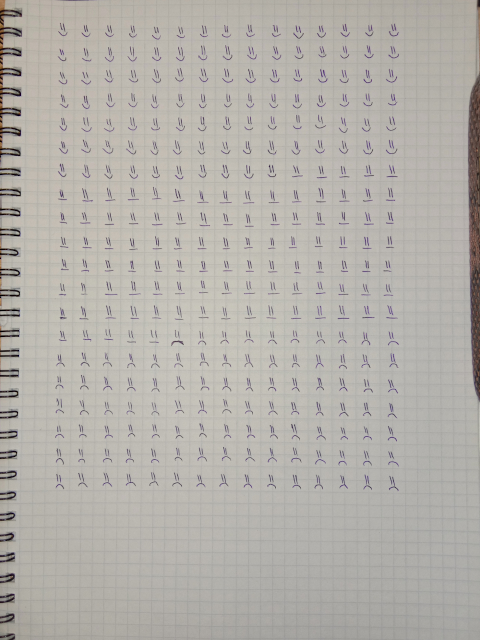
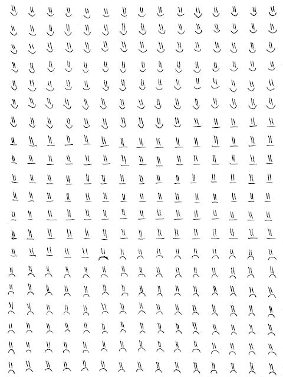
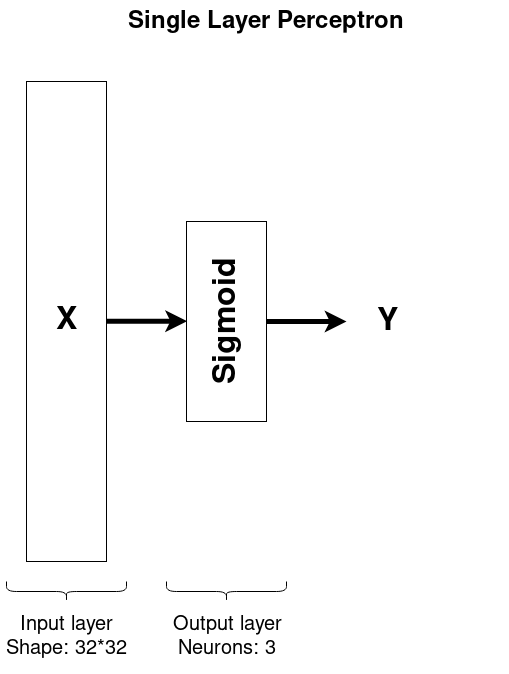
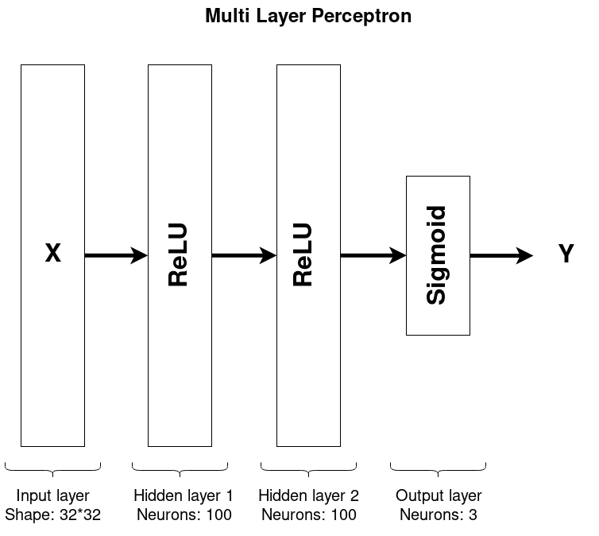
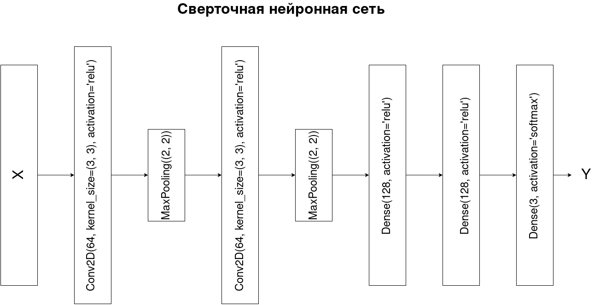

# Отчет по лабораторной работе 
## по курсу "Искусственый интеллект"

## Нейросетям для распознавания изображений


### Студенты: 

| ФИО       | Роль в проекте                     | Оценка       |
|-----------|------------------------------------|--------------|
|Посохин С.А.|Написание символов, обучение нейросетей, подготовка отчёта|              |
|Графчикова Я.А.|Написание символов, обработка фотографий, подготовка данных|              |
|Ли А.В.|Написание симоволов, обучение нейросетей, подготовка отчёта|              |

## Результат проверки

| Преподаватель     | Дата         |  Оценка       |
|-------------------|--------------|---------------|
| Сошников Д.В. |              |               |

> *Комментарии проверяющих (обратите внимание, что более подробные комментарии возможны непосредственно в репозитории по тексту программы)*

## Тема работы

Необходимо подготовить набор данных и построить несколько нейросетевых классификаторов для распознавания рукописных символов.

Вариант задания:
Улыбающиеся, хмуряшиеся и нейтральные смайлики.
```
>>> (ord('G') + ord('P') + ord('L')) % 5 + 1
3
```

## Распределение работы в команде


## Подготовка данных

Каждый участник от руки рисовал по 100 смайликов каждого типа. Затем листок с смайликами фотографировался:


Полученные изображения обрабатывали в редакторе GIMP. В процессе обработки были сделаны следующие операции:
1. Выравнивание изображения
2. Обрезка изображения
3. Задание однородного белого фона
4. Масштабирование
Пример необработанного изображения:



Пример полученного изображения:



Обработанные изображения преобразовывались в массив данных, пригодных для обучения нейросети. Код получения датасета:

```
Python
import os

import cv2

import numpy as np

if __name__ == '__main__':
    path_to_images = 'edited_images/'
    images = []
    print('Файлы которые будут обработаны:')
    for file_ in os.listdir(path_to_images):
        print(f'\t {path_to_images}{file_}')
        images.append(cv2.imread(path_to_images + file_, cv2.IMREAD_GRAYSCALE))
    print('Данные загружены. Выполняю нормализацию...')
    for i in range(len(images)):
        images[i] //= 255
    print('Данные нормализованы. Создаю датасет...')
    y = np.zeros(shape=(300 * len(images)), dtype=np.uint8)
    X = np.zeros(shape=(300 * len(images), 32 * 32), dtype=np.uint8)
    for image_num, image in enumerate(images):
        sub_images = 0
        for y_c in range(0, 640, 32):
            for x_c in range(0, 480, 32):
                X[300 * image_num + sub_images] = image[y_c:y_c+32, x_c:x_c+32].reshape(32 * 32)
                y[300 * image_num + sub_images] = sub_images // 100
                sub_images += 1
        print(f'\tОбработано {(image_num + 1) * 300} из {len(images) * 300}')
    np.savetxt('features.data', X, fmt='%d')
    print('Матрица признаков записана в файл "features.data"')
    np.savetxt('target.data', y, fmt='%d')
    print('Целевая переменная записана в файл "target.data"')

```
Ссылка на получившийся датасет: *TBD*

## Обучение нейросети

### Полносвязная однослойная сеть
**Архитектура**\
\
**Результаты**
```
Model: "sequential_1"
_________________________________________________________________
Layer (type)                 Output Shape              Param #   
=================================================================
dense_1 (Dense)              (None, 3)                 3075      
=================================================================
Total params: 3,075
Trainable params: 3,075
Non-trainable params: 0
_________________________________________________________________
Test_score: 0.6499999761581421; 
Test_loss: 1.0088541163338556
```
### Полносвязная многослойная сеть
**Архитектура**\
\
**Результаты**
```
Model: "sequential_1"
_________________________________________________________________
Layer (type)                 Output Shape              Param #   
=================================================================
dense_1 (Dense)              (None, 128)               131200    
_________________________________________________________________
dense_2 (Dense)              (None, 128)               16512     
_________________________________________________________________
dense_3 (Dense)              (None, 3)                 387       
=================================================================
Total params: 148,099
Trainable params: 148,099
Non-trainable params: 0
_________________________________________________________________
Test_score: 0.8111110925674438; 
Test_loss: 1.0730732235643599
```
### Свёрточная сеть
**Архитектура**\
\
**Результаты**
```
Model: "sequential_1"
_________________________________________________________________
Layer (type)                 Output Shape              Param #   
=================================================================
conv2d_1 (Conv2D)            (None, 30, 30, 64)        640       
_________________________________________________________________
max_pooling2d_1 (MaxPooling2 (None, 15, 15, 64)        0         
_________________________________________________________________
conv2d_2 (Conv2D)            (None, 13, 13, 32)        18464     
_________________________________________________________________
max_pooling2d_2 (MaxPooling2 (None, 6, 6, 32)          0         
_________________________________________________________________
flatten_1 (Flatten)          (None, 1152)              0         
_________________________________________________________________
dense_1 (Dense)              (None, 128)               147584    
_________________________________________________________________
dense_2 (Dense)              (None, 128)               16512     
_________________________________________________________________
dense_3 (Dense)              (None, 3)                 387       
=================================================================
Total params: 183,587
Trainable params: 183,587
Non-trainable params: 0
_________________________________________________________________
Test_score: 0.9555555582046509; 
Test_loss: 0.14364745571122814
```
## Выводы

Как всегда в случае групповой работы, самой сложной частью работы было собрать эту группу и разделить работу на части.
После того как группа была собрана и доступно осведомлена о неминуемом дедлайне, работа была сделана в относительно короткие сроки, частично благодаря советам от сокурсников.
Для корректной работы нейросети обычно требуется очень большой набор данных для обучения. В нашем случае набор данных очень небольшой, однако удалось достичь довольно хорошего результата.
Лучшие результаты были достигнуты при использовании свёрточной нейронной сети, что неудивительно, т.к. распознавание образов является основной задачёй сверточных сетей.
